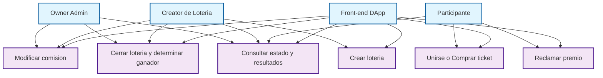

# Lotería DApp — Puntos 1 y 2 (Análisis y Diseño)

  

**Autores:**
	- Marta Pedrido Fernández
	- Diego Dopazo García

**Ejercicio:** 5 - (Lotería online en Ethereum (puntos 1 y 2)  


---

  

## 1) Análisis y definición del escenario

  

### 1.1 Resumen del escenario

Se desea construir una DApp (aplicación descentralizada) que gestione loterías online sobre una blockchain pública (Ethereum). La DApp permitirá crear y gestionar loterías en las que los participantes compran entradas (tickets) por un precio fijo, y al cerrar la lotería se selecciona un ganador aleatorio que recibe el bote menos comisiones. Las loterías son **públicas** (cualquier dirección puede unirse). En futuras versiones se podrían implementar versiones privadas mediante listas de invitados. Los creadores del contrato y los creadores de una lotería en concreto reciben una comisión sobre el total del bote (por defecto 1%).

  

### 1.2 Motivación para usar una blockchain pública

- **Transparencia:** las entradas, pagos y selección del ganador quedan registradas públicamente.

- **Inmutabilidad:** evita manipulación de resultados por parte de operadores centralizados.

- **Accesibilidad global:** cualquier usuario con una wallet Ethereum puede participar.

- **Pago y custodia automática:** las reglas de reparto del bote y comisiones se ejecutan de forma automática mediante el smart contract.

  

### 1.3 Requisitos funcionales (RF)

- RF1 — Crear una nueva lotería especificando: nombre, precio de entrada, número máximo de tickets (o límite de tiempo).

- RF2 — Unirse a una lotería comprando uno o varios tickets pagando `precioTicket * cantidad`.

- RF3 — Registrar participantes y sus tickets en el contrato.

- RF4 — Permitir al owner del contrato modificar la comisión (porcentaje) antes de cerrar la lotería.

- RF5 — Cerrar la lotería manualmente o automáticamente (por tiempo o por alcanzar el número máximo de tickets).

- RF6 — Seleccionar un ganador de manera verificable (en un futuro, usar un oráculo de entropía como Chainlink VRF; en ausencia, usar una mezcla de blockhashes — con advertencias de seguridad).

- RF7 — Pagar al ganador la cantidad del bote menos la comisión, y pagar la comisión al owner.

- RF8 — Permitir la cancelación y reembolso si se cumplen condiciones (opcional).

- RF9 — Consultar estado de una lotería (abierta/cerrada), lista de participantes (o número de tickets), y historial de loterías.
    
- (RF10 - Implementar loterías privadas en un futuro).

  

### 1.4 Requisitos no funcionales (RNF)

- RNF1 — Coste en gas razonable; minimizar almacenamiento en cadena.

- RNF2 — Seguridad: evitar ataques de reentrancy, overflows, manipulación de aleatoriedad.

- RNF3 — Escalabilidad: soportar muchas loterías y muchos participantes.


    
---

  

## 2) Diseño


### 2.1 Caso de uso (resumen)

Actores:

- **Owner / Admin**: despliega contrato, puede cambiar comisión global (si aplica) o parámetros administrativos y recibe comisión.

- **Creator de Lotería**: usuario que crea una lotería específica; puede configurar su lotería y (según diseño) y recibe comisión.

- **Participante**: compra tickets y participa en la lotería.

- **Front-end (DApp)**: interfaz que interactúa con el contrato (Remix, Metamask, etc).

- **Oráculo de Aleatoriedad**: proporciona número aleatorio verificable (por cuestiones de simplicidad no se hace pero se puede implementar en un futuro).

  

Casos de uso principales:

1. Crear lotería (Creator).  

2. Unirse/comprar ticket (Participante).  

3. Modificar comisión (Owner, Creator).  

4. Cerrar lotería y determinar ganador (Creator).  

5. Reclamar premio (Ganador).  

6. Consultar estado y resultados (Cualquiera).

  
### Diagrama de casos de uso


  

### 2.2 Diseño lógico / Contenido del contrato inteligente

  

#### 2.2.1 Estructuras de datos principales

```solidity

struct Lottery {

    uint256 id;

    address creator;           // creador/organizador de esta lotería

    string name;               // nombre opcional

    uint256 ticketPrice;       // precio por ticket (en wei)

    uint256 maxTickets;        // 0 = sin límite en número, usar deadline si aplicable

    uint256 ticketsSold;       // número de tickets vendidos

    uint256 startTime;         // timestamp de inicio

    uint256 endTime;           // timestamp de cierre (0 = manual)

    mapping(address => uint256) ticketsByAddress; // nº de tickets por dirección (si se usa mapping, ver consideraciones)

    address[] participants;    // lista de participantes (guardando direcciones únicas)

    uint256 commissionPercent; // porcentaje como base de 10000 (ej. 200 = 2.00%)

    bool closed;

    address winner;

    uint256 pot;               // total acumulado (opcional si se calcula dinámicamente)

}

```

  

  

#### 2.2.2 Variables de contrato

- `uint256 public nextLotteryId;`

- `mapping(uint256 => Lottery) public lotteries;`

- `uint256 public defaultCommissionPercent; // e.g., 200 = 2.00% (base 10000)`

- `address public owner; // administrador del contrato`


  

#### 2.2.3 Eventos

- `event LotteryCreated(uint256 indexed lotteryId, address indexed creator);`

- `event TicketPurchased(uint256 indexed lotteryId, address indexed buyer, uint256 quantity);`

- `event LotteryClosed(uint256 indexed lotteryId, address indexed closer);`

- `event WinnerSelected(uint256 indexed lotteryId, address indexed winner, uint256 prize);`

- `event CommissionChanged(uint256 indexed lotteryId, uint256 oldPercent, uint256 newPercent);`

  

### 2.3 Funciones públicas / externas (API del contrato)

  

#### Funciones de administración / creador

- `createLottery(string name, uint256 ticketPrice, uint256 maxTickets, uint256 endTime, uint256 commissionPercent) external returns (uint256)`

  - Crea una lotería.

  - `commissionPercent` si no es cero override del default (sólo hasta un máximo predefinido).

- `setDefaultCommissionPercent(uint256 newPercent) external onlyOwner`

  - Cambia la comisión por defecto del contrato.

  - Modifica la comisión de una lotería específica (antes de cerrar).


  

#### Funciones de participantes

- `buyTickets(uint256 lotteryId, uint256 quantity) external payable`

  - Compra `quantity` tickets pagando `quantity * ticketPrice`. Comprueba lotería abierta, no exceder maxTickets ni time limit.

- `getMyTickets(uint256 lotteryId, address participant) external view returns (uint256)`

  

#### Cierre y selección

- `closeLottery(uint256 lotteryId) external`

  - Marca la lotería cerrada y ejecuta la función interna de determinación del ganador mediante un número pseudoaleatorio generado con keccak256. En futuras versiones se podrá integrar un oráculo de aleatoriedad verificable.

  - Sólo el creator o el owner (según reglas) pueden cerrar; también puede cerrarse automáticamente por condiciones (fueque implementado en off-chain frontend o con check on-chain).

- `fulfillRandomness(bytes32 requestId, uint256 randomness) internal` (Chainlink callback)

  - Función interna que realiza la selección del ganador usando un número pseudoaleatorio (fallback). En versiones futuras podría conectarse a un oráculo (VRF).

- `claimPrize(uint256 lotteryId) external`

  - Permite al ganador reclamar premio si no se paga automáticamente en `fulfillRandomness`.

  

#### Lectura / utilidades

- `getLotteryInfo(uint256 lotteryId) external view returns (...)`

- `getParticipants(uint256 lotteryId) external view returns (address[] memory)` (tener cuidado con arrays grandes por gas).


  

### 2.4 Reglas de operación y detalles críticos

  

#### Comisión (fee)

- Internamente, las comisiones se representan en *basis points* (puntos base) con base 10000 para representar porcentajes con dos decimales:

  - 200 = 2.00% por defecto. (100 for the owner 100 for the creator)

- Comisión editable por `owner` o `creator`. 
  


### 2.5 Contratos y módulos

- Uso de `Ownable`, `ReentrancyGuard`, `Pausable` (OpenZeppelin).

  

### 2.6 Flujos secuenciales (resumen)

1. **Crear lotería**: Creator -> `createLottery(...)` -> evento `LotteryCreated`.

2. **Compra de tickets**: Participante -> `buyTickets(lotteryId)` -> evento `TicketPurchased` (se actualiza `ticketsSold`).

3. **Cerrar lotería**: Creator/Owner -> `closeLottery` -> evento `LotteryClosed`.

4. **Determinación del ganador**: Pseudoaleatorio → función interna → el contrato calcula el ganador utilizando un número pseudoaleatorio generado con `uint256 rnd = uint256(keccak256(abi.encodePacked(block.timestamp, block.prevrandao, msg.sender))) % ticketsSold;` 


5. **Reclamación opcional**: Ganador -> `claimPrize` (no se paga automáticamente).

  

### 2.7 Consideraciones de diseño adicionales

- **Modelo de almacenamiento de tickets**: por simplicidad y claridad en el ejercicio, podemos implementar `address[] ticketOwners` donde cada compra push la dirección `quantity` veces.

- **Cancelación y reembolsos**: definir cuando se permiten (ej. si no se alcanzó mínimo de tickets).

  

---

  

## Apéndice — Ejemplo compacto de la API pública (prototipo)

- `createLottery(string name, uint256 ticketPrice, uint256 maxTickets, uint256 endTime, uint256 commissionBps) returns (uint256 lotteryId)`

- `buyTickets(uint256 lotteryId, uint256 quantity) payable`

- `closeLottery(uint256 lotteryId)`

- `requestRandom(uint256 lotteryId)` (si no se hace automáticamente en close)

- `claimPrize(uint256 lotteryId)` (si necesario)

- `setLotteryCommission(uint256 lotteryId, uint256 newCommissionBps)` (onlyCreatorOrOwner)

- `getLottery(uint256 lotteryId) view returns (metadata...)`

- `getTicketsCount(uint256 lotteryId) view returns (uint256)`

  
---

  

**Fin del documento — Puntos 1 y 2**
