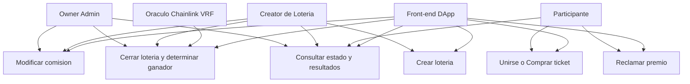

# Lotería DApp — Puntos 1 y 2 (Análisis y Diseño)

  

**Autores:**
	- Marta Pedrido Fernández
	- Diego Dopazo García

**Ejercicio:** 5 - (Lotería online en Ethereum (puntos 1 y 2)  


---

  

## 1) Análisis y definición del escenario

  

### 1.1 Resumen del escenario

Se desea construir una DApp (aplicación descentralizada) que gestione loterías online sobre una blockchain pública (Ethereum). La DApp permitirá crear y gestionar loterías en las que los participantes compran entradas (tickets) por un precio fijo, y al cerrar la lotería se selecciona un ganador aleatorio que recibe el bote menos comisiones. Las loterías pueden ser **públicas** (cualquier dirección puede unirse) o **privadas** (sólo direcciones invitadas pueden unirse). Los creadores del contrato y los creadores de una lotería en concreto reciben una comisión sobre el total del bote (por defecto 1%).

  

### 1.2 Motivación para usar una blockchain pública

- **Transparencia:** las entradas, pagos y selección del ganador quedan registradas públicamente.

- **Inmutabilidad:** evita manipulación de resultados por parte de operadores centralizados.

- **Accesibilidad global:** cualquier usuario con una wallet Ethereum puede participar.

- **Pago y custodia automática:** las reglas de reparto del bote y comisiones se ejecutan de forma automática mediante el smart contract.

  

### 1.3 Requisitos funcionales (RF)

1. RF1 — Crear una nueva lotería especificando: nombre, precio de entrada, número máximo de tickets (o límite de tiempo), tipo (pública/privada), lista de invitados (si privada).

2. RF2 — Unirse a una lotería comprando uno o varios tickets pagando `precioTicket * cantidad`.

3. RF3 — Registrar participantes y sus tickets en el contrato.

4. RF4 — Permitir al owner del contrato (o creator de la lotería) modificar la comisión (porcentaje) antes de cerrar la lotería.

5. RF5 — Cerrar la lotería manualmente o automáticamente (por tiempo o por alcanzar el número máximo de tickets).

6. RF6 — Seleccionar un ganador de manera verificable (mejor usar un oráculo de entropía como Chainlink VRF; en ausencia, usar una mezcla de blockhashes — con advertencias de seguridad).

7. RF7 — Pagar al ganador la cantidad del bote menos la comisión, y pagar la comisión al owner.

8. RF8 — Permitir la cancelación y reembolso si se cumplen condiciones (opcional).

9. RF9 — Consultar estado de una lotería (abierta/cerrada), lista de participantes (o número de tickets), y historial de loterías.

  

### 1.4 Requisitos no funcionales (RNF)

- RNF1 — Coste en gas razonable; minimizar almacenamiento en cadena.

- RNF2 — Seguridad: evitar ataques de reentrancy, overflows, manipulación de aleatoriedad.

- RNF3 — Escalabilidad: soportar muchas loterías y muchos participantes.

- RNF4 — Privacidad: para loterías privadas, las listas de invitados pueden mantenerse on-chain (direcciones) o mediante merkle proofs para privacidad/eficiencia.

    
---

  

## 2) Diseño


### 2.1 Caso de uso (resumen)

Actores:

- **Owner / Admin**: despliega contrato, puede cambiar comisión global (si aplica) o parámetros administrativos y recibe comisión.

- **Creator de Lotería**: usuario que crea una lotería específica; puede configurar su lotería y (según diseño) y recibe comisión.

- **Participante**: compra tickets y participa en la lotería.

- **Oráculo de Aleatoriedad (p.ej. Chainlink VRF)**: proporciona número aleatorio verificable.

- **Front-end (DApp)**: interfaz que interactúa con el contrato (Remix, Metamask, etc).

  

Casos de uso principales:

1. Crear lotería (Creator).  

2. Unirse/comprar ticket (Participante).  

3. Modificar comisión (Owner/Creator según permisos).  

4. Cerrar lotería y determinar ganador (Creator + Oráculo).  

5. Reclamar premio (Ganador).  

6. Consultar estado y resultados (Cualquiera).

  
### Diagrama de casos de uso


```mermaid
graph TD
    %% Actores
    A[Owner Admin]
    B[Creator de Loteria]
    C[Participante]
    D[Oraculo Chainlink VRF]
    E[Front-end DApp]

    %% Casos de uso
    UC1[Crear loteria]
    UC2[Unirse o Comprar ticket]
    UC3[Modificar comision]
    UC4[Cerrar loteria y determinar ganador]
    UC5[Reclamar premio]
    UC6[Consultar estado y resultados]

    %% Relaciones
    A --> UC3
    A --> UC4
    A --> UC6

    B --> UC1
    B --> UC3
    B --> UC4
    B --> UC6

    C --> UC2
    C --> UC5
    C --> UC6

    D --> UC4

    E --> UC1
    E --> UC2
    E --> UC3
    E --> UC4
    E --> UC5
    E --> UC6

```
  

### 2.2 Diseño lógico / Contenido del contrato inteligente

  

#### 2.2.1 Estructuras de datos principales

```solidity

struct Lottery {

    uint256 id;

    address creator;           // creador/organizador de esta lotería

    string name;               // nombre opcional

    uint256 ticketPrice;       // precio por ticket (en wei)

    uint256 maxTickets;        // 0 = sin límite en número, usar deadline si aplicable

    uint256 ticketsSold;       // número de tickets vendidos

    uint256 startTime;         // timestamp de inicio

    uint256 endTime;           // timestamp de cierre (0 = manual)

    bool isPrivate;            // pública o privada

    mapping(address => uint256) ticketsByAddress; // nº de tickets por dirección (si se usa mapping, ver consideraciones)

    address[] participants;    // lista de participantes (guardando direcciones únicas)

    uint256 commissionPercent; // porcentaje como base de 10000 (ej. 200 = 2.00%)

    bool closed;

    address winner;

    uint256 randomRequestId;   // id de la request a VRF (si aplica)

    uint256 pot;               // total acumulado (opcional si se calcula dinámicamente)

}

```

  

  

#### 2.2.2 Variables de contrato

- `uint256 public nextLotteryId;`

- `mapping(uint256 => Lottery) public lotteries;`

- `uint256 public defaultCommissionPercent; // e.g., 200 = 2.00% (base 10000)`

- `address public owner; // administrador del contrato`

- (Opcional) `address public vrfCoordinator;` y variables de Chainlink VRF.

  

#### 2.2.3 Eventos

- `event LotteryCreated(uint256 indexed lotteryId, address indexed creator, bool isPrivate);`

- `event TicketPurchased(uint256 indexed lotteryId, address indexed buyer, uint256 quantity);`

- `event LotteryClosed(uint256 indexed lotteryId, address indexed closer);`

- `event WinnerSelected(uint256 indexed lotteryId, address indexed winner, uint256 prize);`

- `event CommissionChanged(uint256 indexed lotteryId, uint256 oldPercent, uint256 newPercent);`

  

### 2.3 Funciones públicas / externas (API del contrato)

  

#### Funciones de administración / creador

- `createLottery(string name, uint256 ticketPrice, uint256 maxTickets, uint256 endTime, bool isPrivate, address[] memory invited, uint256 commissionPercent) external returns (uint256)`

  - Crea una lotería; si `isPrivate` es true, almacenar `invited` (o su Merkle root).

  - `commissionPercent` si no es cero override del default (sólo hasta un máximo predefinido).

- `setDefaultCommissionPercent(uint256 newPercent) external onlyOwner`

  - Cambia la comisión por defecto del contrato.

  - Modifica la comisión de una lotería específica (antes de cerrar).

- `inviteAddresses(uint256 lotteryId, address[] memory invitees) external onlyCreatorOrOwner`

  - Añadir invitados adicionales para lotería privada.

  

#### Funciones de participantes

- `buyTickets(uint256 lotteryId, uint256 quantity) external payable`

  - Compra `quantity` tickets pagando `quantity * ticketPrice`. Comprueba invitación si privada, lotería abierta, no exceder maxTickets ni time limit.

- `getMyTickets(uint256 lotteryId, address participant) external view returns (uint256)`

  

#### Cierre y selección

- `closeLottery(uint256 lotteryId) external`

  - Marca la lotería cerrada y solicita aleatoriedad a Chainlink VRF (o calcula RNG fallback).

  - Sólo el creator o el owner (según reglas) pueden cerrar; también puede cerrarse automáticamente por condiciones (fueque implementado en off-chain frontend o con check on-chain).

- `fulfillRandomness(bytes32 requestId, uint256 randomness) internal` (Chainlink callback)

  - Callback que recibe el número aleatorio y selecciona ganador usando `randomness % ticketsSold` (mapear índice a ticket/owner).

- `claimPrize(uint256 lotteryId) external`

  - Permite al ganador reclamar premio si no se paga automáticamente en `fulfillRandomness`.

  

#### Lectura / utilidades

- `getLotteryInfo(uint256 lotteryId) external view returns (...)`

- `getParticipants(uint256 lotteryId) external view returns (address[] memory)` (tener cuidado con arrays grandes por gas).

- `isInvited(uint256 lotteryId, address addr) public view returns (bool)`

  

### 2.4 Reglas de operación y detalles críticos

  

#### Comisión (fee)

- Internamente, las comisiones se representan en *basis points* (puntos base) con base 10000 para representar porcentajes con dos decimales:

  - 200 = 2.00% por defecto.

- Comisión editable por `owner` o por `creator` (según permiso definido). Cambios sólo permitidos mientras la lotería no esté cerrada y si no han vendido tickets (o se permite cambiar incluso con tickets vendidos — decisión a tomar; aquí se restringe a antes de la venta o se hace un tope).

  

#### Elección del ganador (aleatoriedad)

- Recomendado: **Chainlink VRF** para evitar manipulación por mineros o creadores.

- Fallback (no recomendado para producción): usar `uint256(keccak256(abi.encodePacked(blockhash(block.number-1), block.timestamp, ticketsSold)))`.

- Mapeo de índice aleatorio a ganador:

  - Si se almacenan tickets como entradas repetidas en array `address[] ticketOwners` donde cada compra añade la dirección `quantity` veces, entonces `randomIndex = randomness % ticketOwners.length` y `winner = ticketOwners[randomIndex]`.

  - Para eficiencia de gas, se puede almacenar rangos y usar cumulative counts por participante.

  

#### Privacidad / Invitados

- Si la lotería es privada, validar `msg.sender` contra la lista de invitados:

  - Opción simple: `mapping(uint256 => mapping(address => bool)) invited;`

  - Opción escalable/privada: usar `Merkle root` y `merkle proof` en `buyTickets` para demostrar inclusión sin almacenar lista completa on-chain.

  

#### Seguridad

- Proteger contra reentrancy (`ReentrancyGuard`).

- Usar `withdraw` pattern para pagos en lugar de `transfer` en la medida que la lógica lo requiera.

- Validar límites: porcentaje máximo de comisión (p.ej. 10% = 1000 basis points).

- Validar que `ticketPrice > 0`.

- Evitar loops grandes en funciones que se ejecutan on-chain (p.ej., no iterar larga lista de participantes en una sola tx).

  

### 2.5 Contratos y módulos sugeridos

- `LotteryFactory` (opcional): contrato que crea loterías y registra ids.

- `Lottery` (structs/logic dentro de un contrato principal).

- Integración con Chainlink VRF (contrato principal hereda `VRFConsumerBaseV2` o similar).

- Uso de `Ownable`, `ReentrancyGuard`, `Pausable` (OpenZeppelin).

  

### 2.6 Flujos secuenciales (resumen)

1. **Crear lotería**: Creator -> `createLottery(...)` -> evento `LotteryCreated`.

2. **Compra de tickets**: Participante -> `buyTickets(lotteryId)` -> evento `TicketPurchased` (se actualiza `ticketsSold`).

3. **Cerrar lotería**: Creator/Owner -> `closeLottery` -> (si VRF) `requestRandomness` -> evento `LotteryClosed`.

4. **Fulfill VRF**: Oráculo -> `fulfillRandomness` -> contrato calcula ganador, transfiere fondos al ganador y comisión al owner (o guarda estado y permite `claimPrize`).

5. **Reclamación opcional**: Ganador -> `claimPrize` (si no se pagó automáticamente).

  

### 2.7 Consideraciones de diseño adicionales

- **Modelo de almacenamiento de tickets**: por simplicidad y claridad en el ejercicio, podemos implementar `address[] ticketOwners` donde cada compra push la dirección `quantity` veces. Es más caro en gas pero más simple de implementar y de entender (adecuado para proyecto académico). Documentar las desventajas y alternativas (rangos, cumulative weights).

- **Comisión editable**: permitir cambiar la comisión si la lotería no está cerrada y no tiene tickets vendidos; o permitir siempre pero documentarlo (impacto en entradas ya vendidas).

- **Cancelación y reembolsos**: definir cuando se permiten (ej. si no se alcanzó mínimo de tickets).

- **Manejo de ETH**: guardar los fondos en el contrato y distribuir en `fulfillRandomness` usando patrón `send/transfer` o `call` con checks-effects-interactions.

- **Front-end**: la DApp (React + Web3/ethers.js) será responsable de construir y mostrar formularios para crear loterías, comprar tickets (firmar tx), y mostrar resultados.

  

---

  

## Apéndice — Ejemplo compacto de la API pública (prototipo)

- `createLottery(string name, uint256 ticketPrice, uint256 maxTickets, uint256 endTime, bool isPrivate, address[] invited, uint256 commissionBps) returns (uint256 lotteryId)`

- `buyTickets(uint256 lotteryId, uint256 quantity) payable`

- `closeLottery(uint256 lotteryId)`

- `requestRandom(uint256 lotteryId)` (si no se hace automáticamente en close)

- `fulfillRandom(uint256 lotteryId, uint256 randomness)` (callback interno)

- `claimPrize(uint256 lotteryId)` (si necesario)

- `setLotteryCommission(uint256 lotteryId, uint256 newCommissionBps)` (onlyCreatorOrOwner)

- `getLottery(uint256 lotteryId) view returns (metadata...)`

- `getTicketsCount(uint256 lotteryId) view returns (uint256)`

  

---

  

## Conclusión y siguiente paso sugerido

Con este análisis y diseño tienes una especificación suficiente para implementar el contrato en Solidity. Recomendado:

1. Implementar un prototipo sencillo que use `address[] ticketOwners` para claridad.

2. Integrar defensas básicas (OpenZeppelin: `Ownable`, `ReentrancyGuard`).

3. Para producción, sustituir la aleatoriedad por Chainlink VRF y optimizar el almacenamiento de tickets (rangos o estructuras compuestas).

  

---

  

**Fin del documento — Puntos 1 y 2**