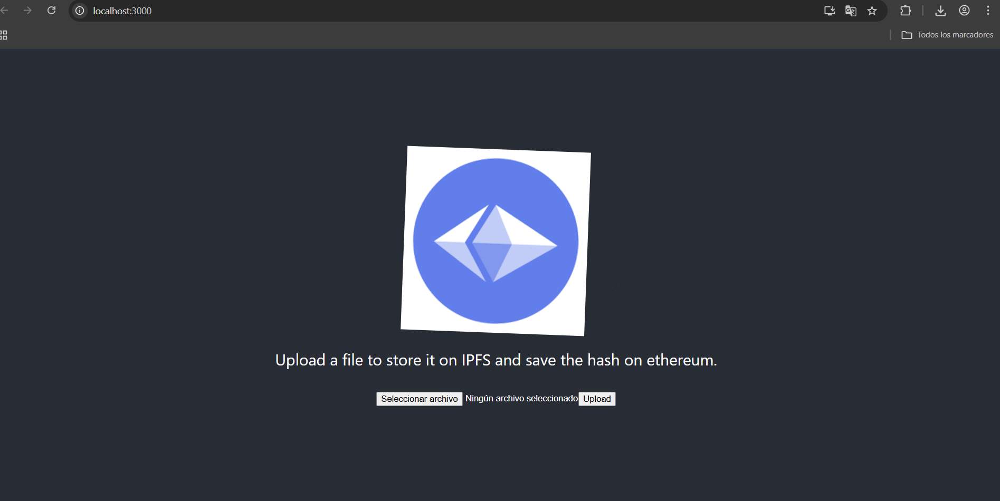
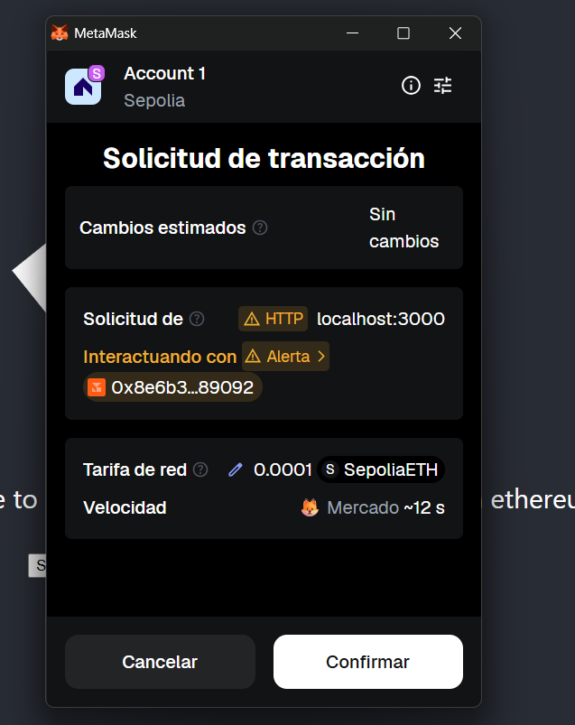
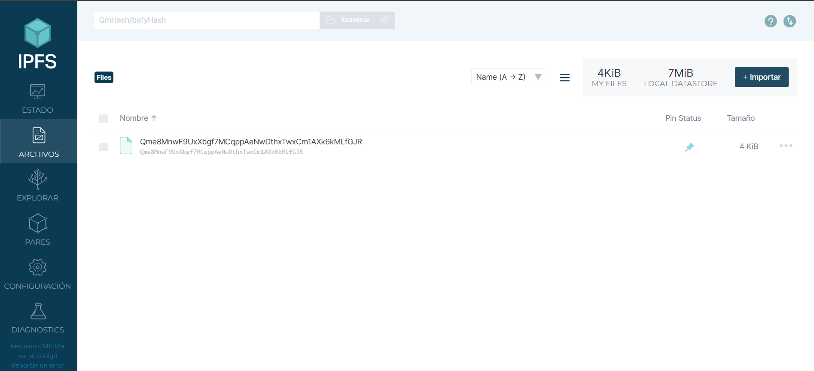

# Esta es la solucion al ejercicio uno de la practica 2

Las capturas que demuestran que funciona son las siguientes:

- En esta captura se muestra como quedo la pagina web:

- En esta captura se muestra la transaccion en MetaMask:

- En esta captura se muestra el archivo en el ipfs:

